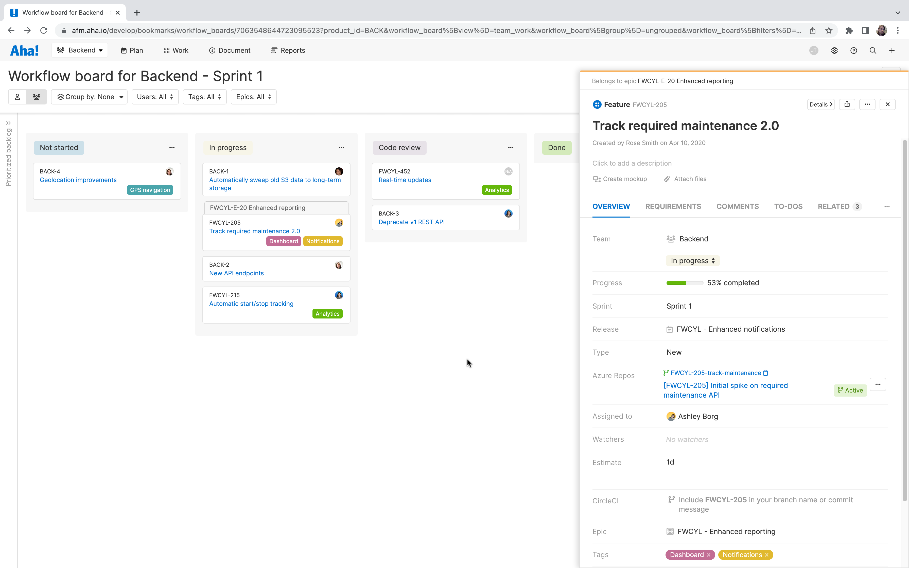
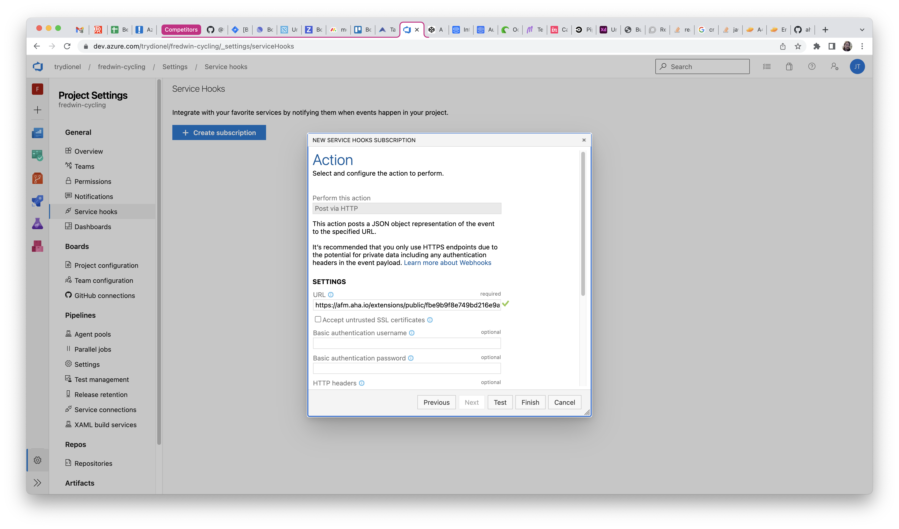

# Azure DevOps Repos for Aha! Develop

This is an extension for [Aha! Develop](https://www.aha.io/develop) providing integration with Azure DevOps Repos.

It provides these contributions:

- `Links attribute` - Link Aha! Develop records to Azure Devops Repos branches and pull requests. See the status checks and approvals for the PR.
- `Webhook` - Automatically links pull requests to records if the PR title starts with the record reference number.



The Azure DevOps Repos extension triggers events that other extensions can use for automation. For example, an extension can listen for the label event:

```js
aha.on({ event: 'aha-develop.azure-devops-repos.pr.update' }, async ({ record, payload }) => {
  record.teamWorkflowStatus = { name: 'In code review' };
  await record.save();
});
```

## Installing the extension

**Note: In order to install an extension into your Aha! Develop account, you must be an account administrator.**

1. Install the Azure DevOps Repos extension by clicking [here](https://secure.aha.io/settings/account/extensions/install?url=https%3A%2F%2Fsecure.aha.io%2Fextensions%2Faha-develop.azure-devops-repos.gz).

2. Configure a webhook in Azure DevOps Repos. The extension will automatically link Aha! records to branches and pull requests in Azure DevOps if you include the Aha! reference number (like `APP-123`) in the name of the branch or pull request. To enable this:

    1. In Aha! Develop, go to Settings -> Account -> Extensions -> Azure Repos Integration -> Webhook from Azure Repos. Copy the hidden URL.
    2. In Azure DevOps, go to the project you want to integrate with Aha! Develop. Visit Project settings > Service hooks.
    3. Create subscriptions for the following events:
        * Web Hooks - Code pushed
        * Web Hooks - Pull request created
        * Web Hooks - Pull request updated
    4. Set the URL field to the value copied in the first step.


  
## Working on the extension

Install `aha-cli`:

```sh
npm install -g aha-cli
```

Clone the repo:

```sh
git clone https://github.com/aha-develop/azure-devops-repos.git
```

Install required modules:

```sh
yarn install
```

**Note: In order to install an extension into your Aha! Develop account, you must be an account administrator.**

Install the extension into Aha! and set up a watcher:

```sh
aha extension:install
aha extension:watch
```

Now, any change you make inside your working copy will automatically take effect in your Aha! account.

## Building

When you have finished working on your extension, package it into a `.gz` file so that others can install it:

```sh
aha extension:build
```

After building, you can upload the `.gz` file to a publicly accessible URL, such as a GitHub release, so that others can install it using that URL.

To learn more about developing Aha! Develop extensions, including the API reference, the full documentation is located here: [Aha! Develop Extension API](https://www.aha.io/support/develop/extensions)
